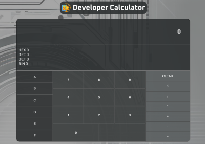

# Developer Calculator

🖥 Um clone inspirado na calculadora de programador do Windows

## 🛠 Funcionalidades
Versão 0.0.1
- [x] Utilizar clique ou leitura de teclado
- [x] Realizar operações básicas
- [ ] Converter o número digitado em decimal para outros sistemas de númeração: Binário, Octal, Hexadecimal
- [ ] Escolher qual sistema de númeração desejo digitar
- [ ] Operar em outros sistemas de númeração 

## 🛠 Tecnologias

- <a href="https://developer.mozilla.org/pt-BR/docs/Web/JavaScript">Javascript Vanilla</a>
- <a href="https://developer.mozilla.org/pt-BR/docs/Web/HTML">HTML</a>
- <a href="https://developer.mozilla.org/pt-BR/docs/Web/CSS">CSS</a>
- <a href="https://git-scm.com/">Git</a>
##  📝  Melhorias
**Plano de Melhorias:**
- [x] Refatoração
- [ ]  Responsividade e acessibilidade
- [ ]  Experiência do usuário
- [ ]  Novas Funcionalidades 

## 🚀 Autor
Riquelmo Medeiros, estudante de Desenvolvimento Web **front-end**, atualmente cursando ciência da computação pela Universidade Federal Rural do Semiárido.

## Informações Adicionais

- 🧠 Base em:
- **Javascript**
- **HTML**
- **CSS**    
- 📘 Aprendendo:
- **React**

## Perfis para contato
Você pode me encontrar e visualizar minhas atividades através dos links abaixo:
- <a href="https://github.com/RickM19">Github</a>
- <a href="https://www.linkedin.com/in/riquelmo-medeiros-5a1304288/">Linkedin</a>
- <a href="https://www.instagram.com/riquelmo_rick/">Instagram</a>
